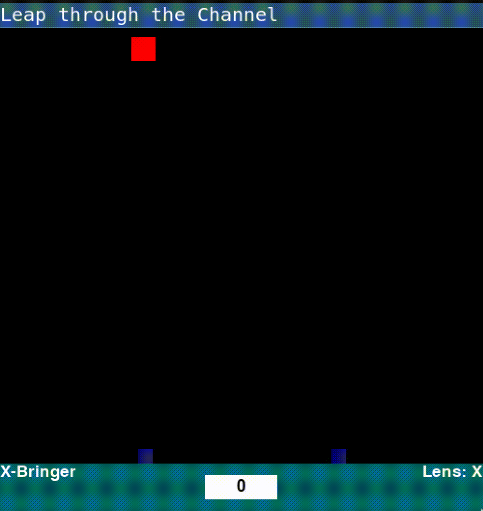

# Leap through the Channel

<p align="left">
  <a href="https://azure.microsoft.com/en-us/solutions/quantum-computing/" target="_blank"> </a>
  <a href="https://ionq.com/" target="_blank"></a>
  <a href="https://iquhack.mit.edu/" target="_blank"> </a>
</p>


A simplistic arcade-like shooter game powered by Qiskit, Azure, and IONQ computers.

Try to defeat incoming invaders by selecting the correct weapon (left and right arrow keys) and firing (space). You may encounter some unexpected behavior with your weapon (quantum noise). But do not fear, once you beat enough enemies you will be awarded upgrades that fix your weapon (quantum error correction!)

Your weapons include: `hadafire`, `x-bringer`, `z-bringer` which correspond to quantum gates!

## Demo


## Running
- Ensure you have `python3` and `pip3` installed
- Download this repo and enter directory
- `pip install -r requirements.txt`
- `./main.py`

### Behind the scenes

If you want to learn about how it works, as well as the error correction, look [here](tutorial/tutorial.ipynb)

## Files and Structure
```
.
├── entities
│   ├── bullet.py
│   ├── dashboard.py
│   ├── enemy.py
│   ├── __init__.py
│   ├── player.py
│├── levels
│   ├── __init__.py
│   ├── level0.py
│   ├── level_controller.py
│   └── level.py
├── main.py
├── media
│   └── demo.gif
├── README.md
└── requirements.txt
```

## References
```
[1]R. Chao and B. W. Reichardt, “Fault-tolerant quantum computation with few qubits,” npj Quantum Inf, vol. 4, no. 1, p. 42, Dec. 2018.
[2]M. Urbanek, B. Nachman, and W. A. de Jong, “Quantum error detection improves accuracy of chemical calculations on a quantum computer,” arXiv:1910.00129 [physics, physics:quant-ph], Sep. 2019.
```
